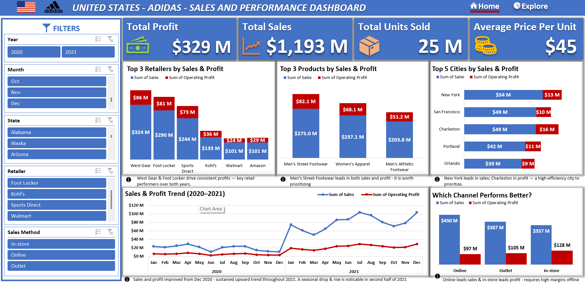
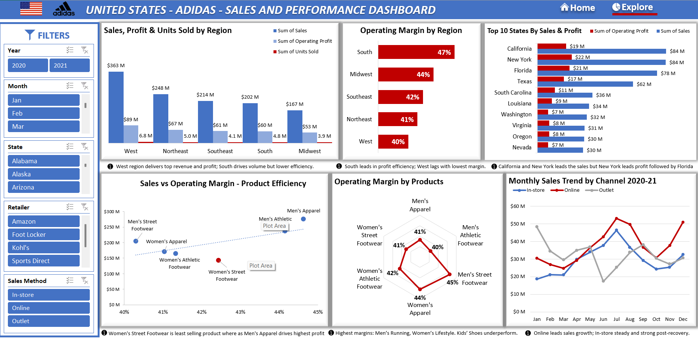

# US Adidas Sales & Performance Dashboard

## Project Overview

This project involved developing a **comprehensive and interactive sales and profitability dashboard** in Microsoft Excel. The primary goal was to transform raw Adidas sales transaction data into actionable business intelligence, enabling stakeholders to monitor performance, identify trends, and make **data-driven decisions** regarding sales strategy, product management, and regional focus.

## 🛠️ Tools and Technologies

* **Microsoft Excel:** Used for data cleaning, manipulation, creating **Pivot Tables**, building **Pivot Charts**, and assembling the final interactive Dashboard.
* **Dataset:** US Adidas Sales Dataset (publicly available sales transaction data). Link provided in `Excel Project.pdf`.

## 📊 Dashboard Key Features

The final solution consists of a two-page interactive dashboard leveraging **Pivot Charts** and **Slicers** for dynamic filtering.

### Dashboard 1: Sales Performance & Profitability Summary

This page focuses on executive-level performance monitoring:

| Visualization | Insight Provided |
| :--- | :--- |
| **Key Performance Indicators (KPIs)** | Displays **Total Sales**, **Total Operating Profit**, **Total Units Sold**, and Overall **Average Price Per Unit**. |
| **Sales Trend Over Time** | Monthly performance visualization to identify seasonality and growth patterns. |
| **Top 3s by Retailer, Product, and City** | Direct comparison of top-performing retailers, products, and cities by sales and profit. |
| **Sales Channel Performance** | Comparison of profitability across **In-store**, **Online**, and **Outlet** channels. |

### Dashboard 2: Regional & Product Analysis

This page provides detailed analysis across regions, retailers, and products:

| Visualization | Insight Provided |
| :--- | :--- |
| **Sales, Profit and Units Sold by Region ** | Allowing quick comparison of regional performance. |
| **Top 10 States** | Ranks individual states by total profitability. |
| **Product Efficiency** | Shows contribution of each product category to total sales. |
| **Interactivity** | Includes key **Slicers** for **Retailer**, **Region**, **Product Category**, and **Sales Method** to filter the dashboard dynamically. |

## ✅ Project Objectives Met

The project successfully addressed all core requirements:

1. **Data Preparation:** Raw data was cleaned and processed (as shown in the `Cleaned Dataset` sheet) to ensure accuracy.
2. **Performance Analysis:** Sales and profit tracked across regions, retailers, and products.
3. **Trend Analysis:** Monthly and yearly performance trends visualized using the `Invoice Date` field.
4. **Interactivity:** Fully interactive dashboard built using slicers for quick filtering and drill-down analysis.

## 💡 Key Business Insights & Recommendations

Based on the dashboard analysis, the following actionable insights were derived:

* **Regional Optimization:** The **West** region drives the highest sales volume but may not always have the highest operating margin. **Recommendation:** Review pricing and logistics in this region to improve net profitability.  
* **Channel Strength:** The **Online** sales method is highly efficient, contributing strong sales and healthy operating margins. **Recommendation:** Prioritize investment in the e-commerce channel.  
* **Product Performance:** Significant variation exists between product categories. **Recommendation:** Analyze inventory and marketing spend for underperforming products to optimize sales and profitability.

## 📁 Repository Files

* `US-Adidas-Sales.xlsx` – Final Excel project file containing cleaned data, Pivot Tables, Pivot Charts, and the complete two-page dashboard.  
* `Excel Project.pdf` – Original project brief and dataset link.  
* `Dashboard1.png` – Image preview of the **Sales Performance & Profitability Summary** dashboard.  
* `Dashboard2.png` – Image preview of the **Regional & Product Analysis** dashboard.  

## 📝 How to Use the Dashboard

1. Open `US-Adidas-Sales.xlsx` in Microsoft Excel (2016 or later recommended).  
2. Navigate to the **Dashboard 1** or **Dashboard 2** sheet.  
3. Use the **Slicers** to filter data by **Retailer**, **Region**, **Product Category**, and **Sales Method**.  
4. Hover over charts to see detailed values.  
5. For dataset details, refer to the `Excel Project.pdf`.

