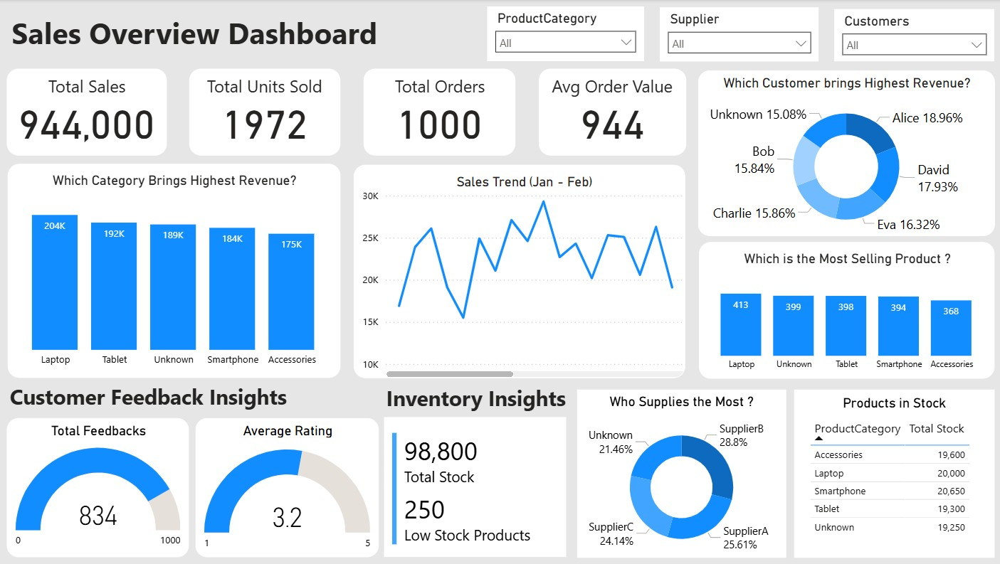

# 🛒 Retail Insights Dashboard – Power BI

## 📌 Project Overview

This project showcases my ability to **clean, transform, and analyze** a highly uncleaned retail dataset and deliver actionable insights through a comprehensive Power BI dashboard. It specifically addresses three key business areas: **Sales Performance**, **Customer Feedback**, and **Inventory Management**.

The original dataset contained approximately $\mathbf{20\%}$ random missing values across both text and numeric columns. If standard listwise deletion were applied, the remaining usable dataset would have been reduced to only $\mathbf{30\%–40\%}$ of the original records. Rather than discarding a large portion of the data, I employed robust **data imputation strategies** and transparent handling of "Unknown" values to preserve data integrity and utility. The original problem brief is available in the `Power BI Project.pdf`.



## 🧹 Data Cleaning & Transformation

The data was cleaned and transformed using Power Query to address missing values and enforce consistency.

### Missing Value Imputation

- **Text Columns** ($\text{Customer Name, Product Category, Supplier}$): NULL values were replaced with the **“Unknown”** category.
- **Numeric Columns** ($\text{Quantity, Price, Stock}$): NULL values were replaced with the **median** of the respective column.

### Consistency & Handling

- **Column Renaming**: Confusing column names were renamed (e.g., $\text{Product}$ to $\text{Product Category}$).
- **DAX Development**: Created DAX measures for all key performance indicators (KPIs) and calculated columns (e.g., $\text{Revenue} = \text{Quantity} \times \text{Price}$).

## 📊 Dashboard Features & Key Metrics

The dashboard provides immediate, data-driven answers across the three key business areas.

### Sales Performance

| KPI                 | Value (from Dashboard) | Insights Delivered           |
| :------------------ | :--------------------- | :--------------------------- |
| **Total Sales**     | **$944,000**           | Overall revenue performance. |
| **Avg Order Value** | **$944**               | Customer spending behavior.  |

- **Highest Revenue Categories**: Identified **Laptop** ($\mathbf{204K}$) and **Tablet** ($\mathbf{192K}$) as the top-performing categories.

### Customer Feedback

| Metric              | Value (from Dashboard) | Insights Delivered                   |
| :------------------ | :--------------------- | :----------------------------------- |
| **Total Feedbacks** | **834**                | Total volume of customer responses.  |
| **Average Rating**  | $\mathbf{3.2 / 5.0}$   | Overall customer satisfaction level. |

### Inventory Management

| Metric                 | Value (from Dashboard) | Insights Delivered                                  |
| :--------------------- | :--------------------- | :-------------------------------------------------- |
| **Total Stock**        | **98,800** units       | Current inventory magnitude.                        |
| **Low Stock Products** | **250**                | Identified products requiring immediate restocking. |

## 🔑 Key Findings

- **Data Quality Impact**: **$15.08\%$** of total revenue comes from **Unknown** customers, indicating a need for improved front-end data collection to strengthen $\text{CRM}$ strategies.
- **Revenue Drivers**: **Laptop** and **Tablet** are the dominant revenue categories, but $\mathbf{\$189K}$ in revenue was initially classified as an "Unknown" product category due to data issues, highlighting the success of the imputation strategy.
- **Improvement Area**: The **Average Rating of 3.2** suggests a neutral-to-positive sentiment, which flags specific areas for targeted improvement in the customer experience.

## 📁 Repository Structure

```text
📦 Retail-Insights
 ┣ Project.pbix (Power BI project file)
 ┣ Dashboard.jpg (Overview Dashboard Image)
 ┣ Power BI Project.pdf (Original project brief)
 ┣ README.md
```

## 🚀 Skills Demonstrated

- **Data Cleaning** (missing value imputation, categorical handling)
- **Data Transformation** (Power Query, calculated columns)
- **Data Modeling** (establishing table relationships)
- **DAX** (KPIs, measures, calculated columns)
- **Dashboard Design** (interactive visuals, data storytelling)

## Project Summary

This project demonstrates expertise in end-to-end data analysis, transforming a highly uncleaned retail dataset into a strategic Power BI Dashboard. Core skills include **data imputation** (handling $\approx 20\%$ missing values), **DAX development** for key KPIs ($\text{Total Sales}$, $\text{Avg Order Value}$, $\text{Avg Rating}$), and designing visualizations that drive business decisions in **Sales Performance**, **Customer Feedback**, and **Inventory Management**. Key insights include identifying $\text{Laptop}$ and $\text{Tablet}$ as top revenue drivers and flagging critical data quality issues in $\text{Customer}$ and $\text{Product}$ categories.
